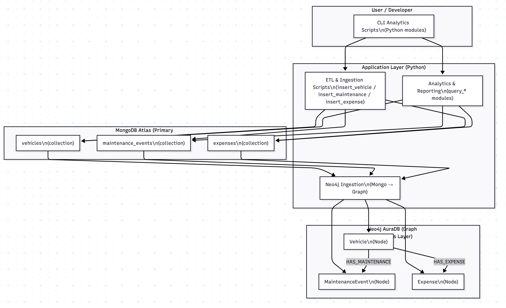
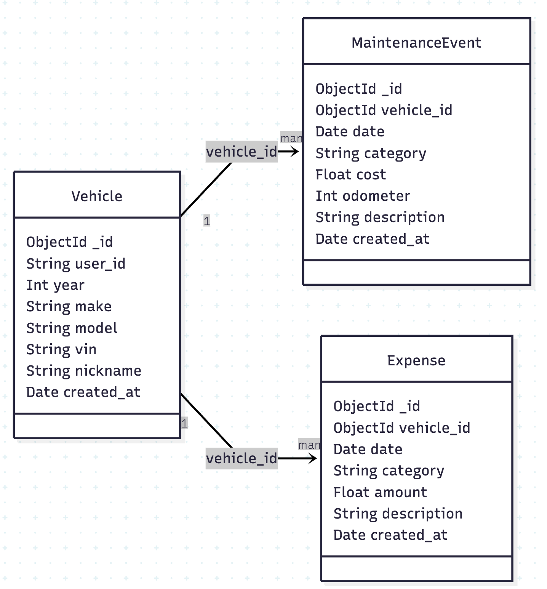
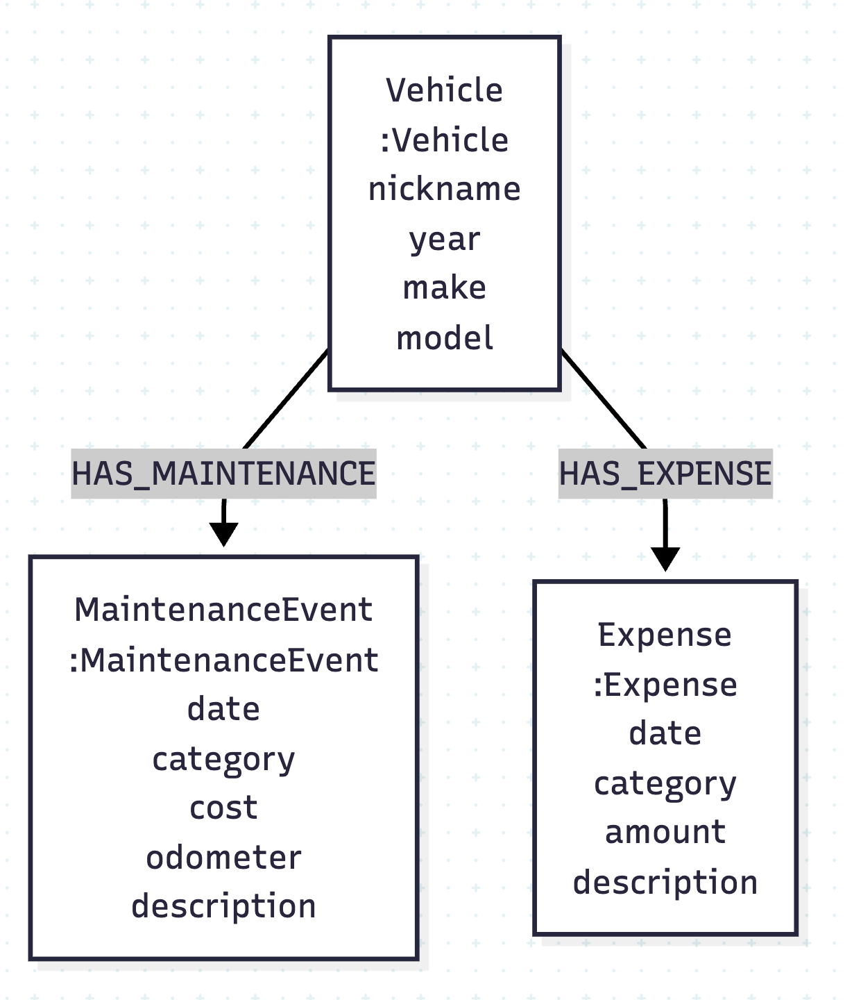

## Project Summary

My Vehicle Intelligence Platform is a stateful data system for tracking vehicles, maintenance, expenses, and ownership costs over time. It unifies different types of vehicle records you may keep into a structured database and uses both document based and graph based analytics to surface cost trends, maintenance intervals, and long term ownership insights. In my projects current state, it demonstrates my implementation of real world data modeling, aggregation, and system design principles using cloud hosted MongoDB and Neo4j backends.

## Diagrams and Demo Video

Watch the demo video: [here](https://youtu.be/aulI27xCsa4)

### Diagram 1: Overall system architecture (MongoDB + Neo4j + CLI analytics)

### Diagram 2: MongoDB data model (vehicles, maintenance_events, expenses)

### Diagram 3: Neo4j graph model (Vehicle → Maintenance / Expense relationships)  

## What I Learned in This Project

This project deepened my understanding of how real database backed systems are designed, operated, and queried beyond basic CRUD operations. I fell like I truly came to understand how MongoDB Atlas clusters function as managed database infrastructure, how application code connects to a specific database within a cluster, and how permissions and roles affect which operations are allowed at runtime.

I was also able to cement my understanding of how schema design, indexing, and aggregation pipelines directly impact correctness and performance. Implementing JSON Schema validators clarified the difference between schema-less storage and schema-less discipline, while building aggregation pipelines reinforced how analytics should be pushed into the database rather than handled entirely in application code.

When integrating Neo4j, I had to think about data differently. I had to model relationships explicitly rather than relying solely on my document joins. This helped me understand when graph databases are a better fit for timeline analysis, category rollups, and relationship-based queries that would be awkward or inefficient in a purely document oriented model.

## AI Integration

The current implementation does not directly integrate AI at runtime. However, in an effort to make my project more impressive for job interviews, I have set it up for meaningful AI integration which will use an LLM to analyze vehicle history and answer questions such as predicting future maintenance costs, comparing the long-term cost of ownership across vehicles, or summarizing spending patterns in natural language.

## How AI Was Used During Development

AI was used throughout the project to help me "rough draft" my designs for data models and construct correct MongoDB aggregation pipelines. I found it very helpful when it came to validating assumptions about index usage and debugging permission/validation in MongoDB Atlas and Neo4j.

## Why This Project Is Interesting to Me

Personally, I am meticulous about my vehicle and already track maintenance, expenses, modifications, and future plans manually using notes and spreadsheets. This is because I drive a 20+ year old 4RUNNER that was gifted to me by my grandfather. I have had this car since I got my driver's license and maintaining it is important to me.This project formalizes that habit into a real system that solves an actual problem I deal with as a vehicle owner.

Because the data reflects real decisions (such as budgeting for repairs, evaluating maintenance intervals, or deciding whether continued ownership is worthwhile) the project feels practical and meaningful. It also allowed me to apply database concepts to a domain I care about, which made the learning process more engaging and the final result more polished and realistic.

## Key Learnings

1. **Even NoSQL needs structure**
   MongoDB doesn’t force a schema, but in practice you still need rules. Using JSON Schema validation helped keep the data clean without losing flexibility.

2. **Database-side analytics matter**
   Using aggregation pipelines (`$match`, `$group`, `$sum`) was far more efficient than pulling data into the app and processing it there.

3. **Indexes only help if they match real queries**
   Indexes made a big difference once they were designed around how the data was actually queried, not just what looked good on paper.

4. **Graphs are great for relationship-heavy data**
   Neo4j made it much easier to work with timelines and relationships that would have been awkward or complex in MongoDB alone.

5. **Cloud databases add real-world complexity**
   Things like permissions, quotas, drivers, and managed failover ended up being just as important as the database schema itself.

   Permissions, roles, quotas, driver behavior, and managed failover are just as important as schema design when working with cloud databases.

## System Design Considerations

MongoDB Atlas is the main database, handling durable storage with built in replication and failover so data survives client or local failures.

Neo4j is used alongside MongoDB for analytics that focus on relationships, timelines, and rollups. Using both shows how different databases can be combined based on what they do best.

Performance relies on indexed fields like `vehicle_id`, `date`, and `category`, with aggregations scaling per vehicle rather than across the entire dataset.

Access is controlled through database-level users and permissions, and both MongoDB and Neo4j handle concurrency safely so multiple clients can write at the same time.

Future work could add stricter business rules, idempotent writes, and caching for frequently used analytics.

## Class Channel Post

https://youtu.be/aulI27xCsa4

**Share permission:** Yes, share
